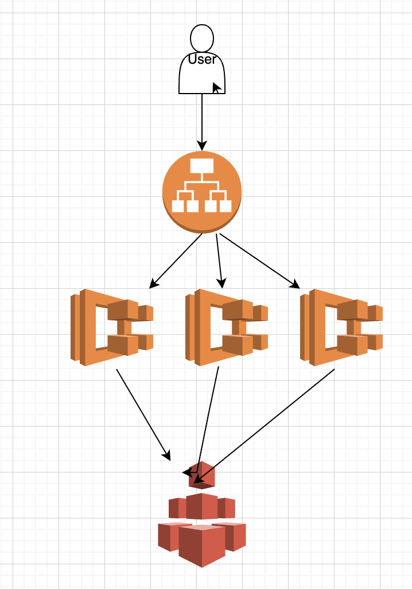
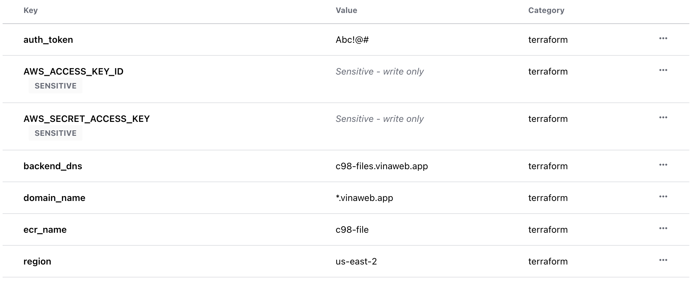
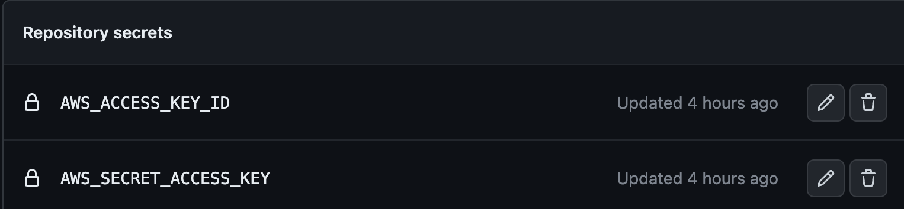
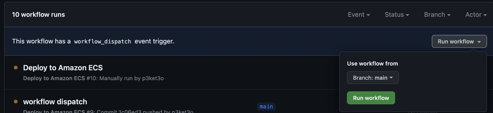

This is an infrastructure as code completed with terraform.

## Infrastructure Design
We have an internet facing Application Load Balaner follow with some ECS fargate for backend and AWS EFS as shared volume


## Getting Started
1. Create an terraform cloud organizations and update file **provider.tf** with your organizations/workspaces
2. Add variables to terraform cloud:
+ **auth_token**: We have a public api but I've setup some extra header called **X_Request_Token** to prevent public access to our API, that will be our value for this header
+ **AWS_ACCESS_KEY_ID** and **AWS_SECRET_ACCESS_KEY** the admin key for terraform to interact with AWS
+ **ecr_name** ECR repository for store docker images
+ **region** AWS region
+ **domain_name** root domain name for https certificate issued by AWS ACM
+ **backend_dns** our backend API endpoint

3. Terraform init to init the repository
4. Terraform plan to verify what will be created
5. Terraform apply --auto-approve. Get the output on terraform cloud to update on your DNS provider.
6. After terraform provision all the infrastructure. We need to push a CICD process because right now we dont have any docker images on ECR so our backend can't start
7. Folk my backend source code to your own repository, my backend is available at: https://github.com/p3ket3o/C98-file.git
8. I used github action for CICD, you need to replace my file at **.github/workflows/aws.yml** with your own variable
+ **ECR_REPOSITORY** is the same with **ecr_name** on terraform cloud
+ **AWS_REGION** is the same with **region** on terraform cloud
9. We use public runner for CICD, so we need to add some secret to repository in order to interact with AWS. Our terraform code have been create an IAM user called **github-action** with AccessKey and Secret Access key. Please retrieve your terraform state file to get this value and add the secret to github

10. Manual trigger a CICD workflow to build an image because at the first time we don't have any code change. Next time the CICD will run automatically if we have any change on **main** branch

11. After github action run success, we can test our API.
+ First, add a file to our API 
example, please update with your endpoint, header value and file
```bash
curl --location 'https://c98-files.vinaweb.app/files' \
--header 'X_Request_Token: Abc!@#' \
--form 'file=@"/Users/trong/workspace/text"'
```
+ Second, read the file
```bash
curl --location 'https://c98-files.vinaweb.app/files/text' \
--header 'X_Request_Token: Abc!@#'
```
+ Third, delete the file
```bash
curl --location --request DELETE 'https://c98-files.vinaweb.app/files/text' \
--header 'X_Request_Token: Abc!@#'
```
## Destroy
First, we need to delete docker image first because we can't delete ECR if it have any image.
```bash
./remove_ecr.sh $YOUR_REGION $YOUR_ECR
example: ./remove_ecr.sh us-east-2 c98-file
```
terraform destroy --auto-approve
## Motivation
AWS ECS is more simple that EKS. Because our service is very simple so I choose ECS for lower price
Currently we use public runner for github, next time we can setup a self runner for that